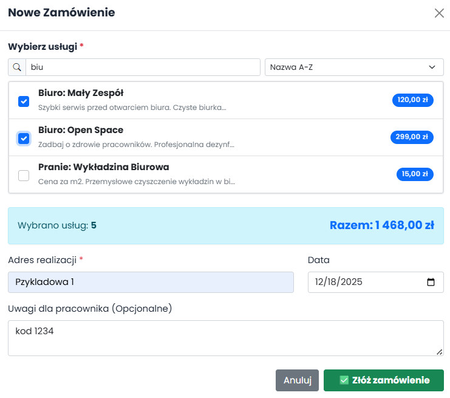

# 🧹 Cleaning Service Management System

> **Engineering Thesis Project** > A comprehensive Single Page Application (SPA) for managing cleaning services, orders, and employees. Built with **.NET 7/8** and **Blazor Server**.


## 📖 About The Project

This application was developed as part of my Engineering Thesis to streamline the workflow of a cleaning company. It solves the problem of manual order handling by providing a centralized platform for Administrators, Employees, and Clients.

The system utilizes **Blazor Server** for a responsive, interactive user experience without the need for full page reloads, and **SignalR** for real-time data updates.

### Key Features
* **Real-time Updates:** Uses **SignalR (WebSockets)** to instantly update the order dashboard for admins when a new order is placed.
* **Role-Based Access Control (RBAC):** Secure authentication utilizing **ASP.NET Core Identity** with distinct roles:
    * *Administrator:* Manage services, employees, and view financial reports.
    * *Employee:* View assigned tasks and update order status.
    * *Client:* Book services and view order history.
* **PDF Generation:** Automatic generation of invoices and reports using **QuestPDF/iTextSharp**.
* **Data Validation:** Robust server-side and client-side validation using **Data Annotations**.
* **Responsive Design:** Fully responsive UI built with **Bootstrap 5**, accessible on mobile and desktop devices.

## 📸 Screenshots

| Client | Order Form |
|:---:|:---:|
|  |  |

| Admin | Users Panel |
|:---:|:---:|
|  |  |

| First View | 
  

## 🛠️ Tech Stack

* **Framework:** .NET 7 / .NET 8
* **Frontend:** Blazor Server, HTML5, CSS3, Bootstrap 5
* **Database:** SQL Server
* **ORM:** Entity Framework Core (Code-First Approach)
* **Authentication:** ASP.NET Core Identity
* **Real-time Communication:** SignalR
* **Architecture:** 3-Layer Architecture (Presentation, Logic/Services, Data)

## 🚀 How to Run

To run this project locally, follow these steps:

1.  **Clone the repository**
    ```bash
    git clone [https://github.com/twoj-nick/cleaning-app.git](https://github.com/twoj-nick/cleaning-app.git)
    ```

2.  **Configure Database**
    Update the connection string in `appsettings.json` to point to your local SQL Server instance:
    ```json
    "ConnectionStrings": {
      "DefaultConnection": "Server=(localdb)\\mssqllocaldb;Database=CleaningAppDb;Trusted_Connection=True;"
    }
    ```

3.  **Apply Migrations**
    Open the Package Manager Console (PMC) or terminal and run:
    ```bash
    update-database
    ```
    *This will create the database and seed initial data (Admin account/Services).*

4.  **Run the Application**
    ```bash
    dotnet run
    ```

## 📂 Project Structure

The solution follows a modular architecture:
* `CleaningApp.Web` - Blazor components and Pages (UI).
* `CleaningApp.Core` - Domain models and Business Logic (Services).
* `CleaningApp.Data` - DbContext and Migrations.

## 📬 Contact

**Vladyslav Turchynovych**

Email: prolinger921@gmail.com  
LinkedIn: https://www.linkedin.com/in/vladyslav-turchynovych-65a797256/
---
